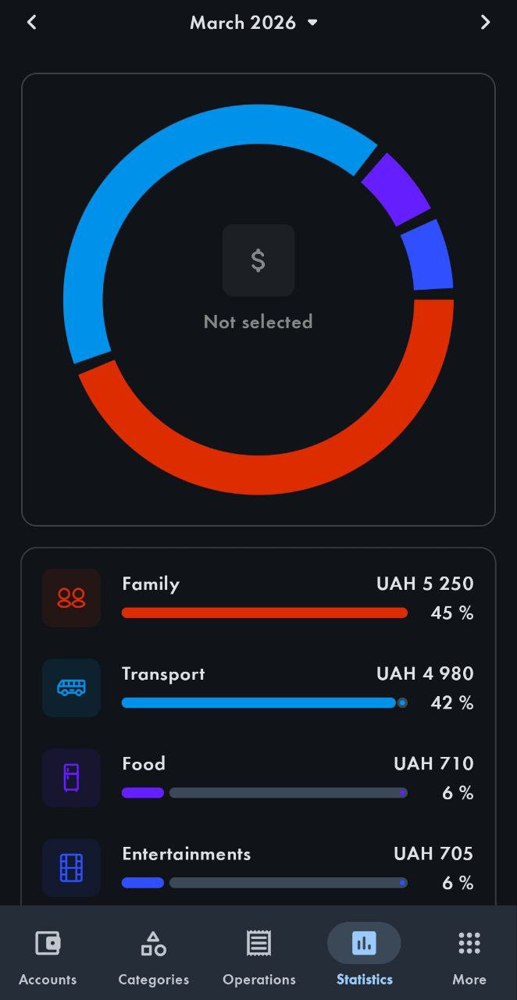

# WishList

## Сторінка логіну/реєстрації
- Біометрія: користувач може увійти через відбиток пальця/скан обличчя

## Головна сторінка (список категорій)
- Виводити фотку балансів
- Витрати/доходи по категоріях: на кожній категорії показується цифра - сума за місяць
- Календар: зверху оберається місяць і відносно нього змінюються числа навпроти категорій
- Місячний баланс: під загальним балансом показується скільки витрат і доходів за місяць
- Можливість згортання хедера балансів

## Сторінка редагування/стврення категорій
- Додати обнулення фото
- Створити бібліотеку іконок

## Сторінка редагування/стврення балансів
- Додати обнулення фото

## Архів операцій
- Календар: показуються лише операції місяця
- Статистика: є вкладка, яка показує діаграми операцій по категоріям як тут:
